# week5

要求三：SQL CRUD
------------

使用INSERT指令新增一筆資料到member資料表中，這筆資料的username和password欄位必須是test，接著繼續新增至少4筆隨意的資料

使用SELECT指令取得所有在member資料表中的會員資料

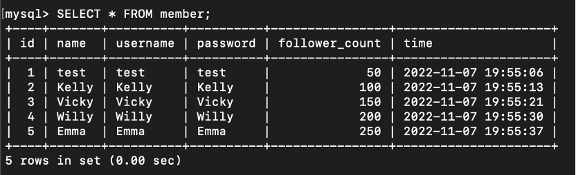

使用SELECT指令取得所有在member 資料表中的會員資料，並按照time欄位，由近到遠排序．

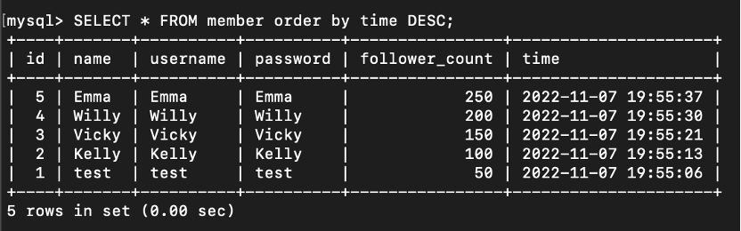

使用SELECT指令取得在member 資料表中第2～4共三筆資料，並按照time欄位，由近到遠排序．

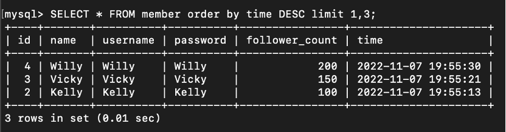

使用SELECT指令取得欄位 username 是test的會員資料。

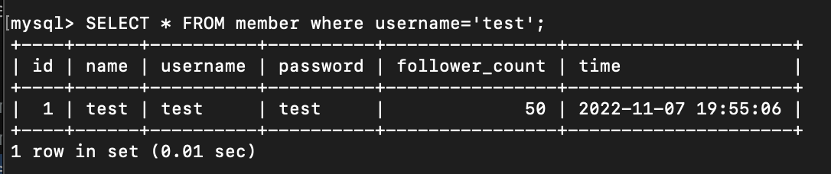

使用SELECT指令取得欄位 username 是test且欄位password也是test的資料。

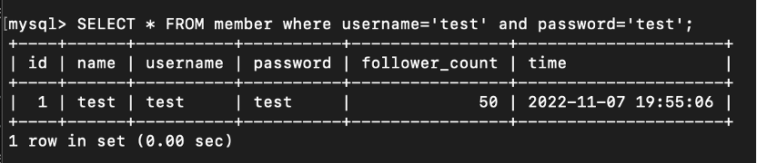

使用UPDATE指令取得欄位 username 是test的會員資料，將資料中的name欄位改成test2

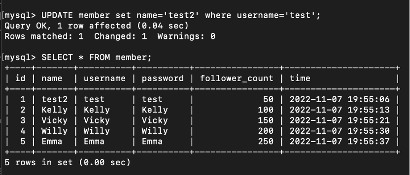

要求四：SQL Aggregate Functions
---------------------------

取得member資料表中，總共有幾筆資料（幾位會員）

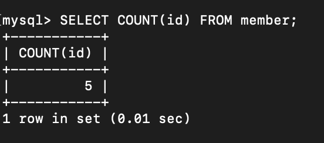

取得member資料表中，所有會員follower\_count欄位的總和

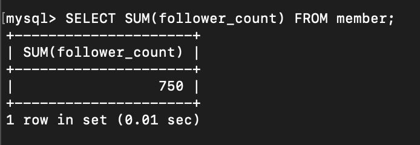

取得member資料表中，所有會員follower\_count欄位的平均數

要求五：SQL JOIN
------------

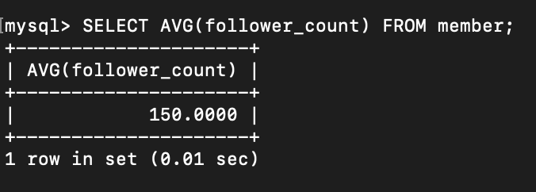

在資料庫中建立新資料表紀錄留言資訊，取名字為message

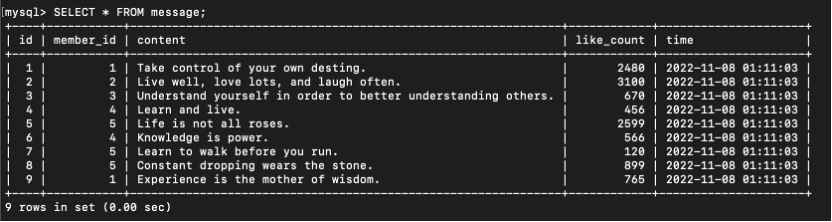

使用SELECT搭配JOIN語法，取得所有留言，結果須包含留言者的姓名

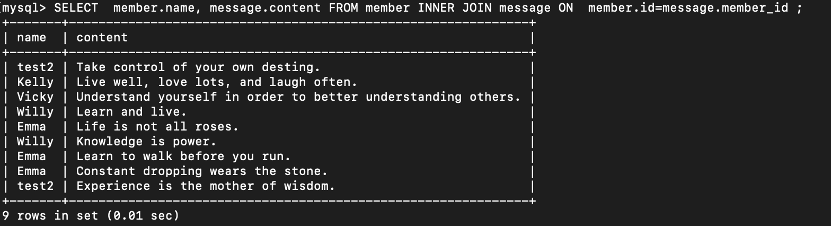

使用SELECT搭配JOIN語法，取得member資料表中欄位username是test的所有留言，資料中需包含留言者的姓名

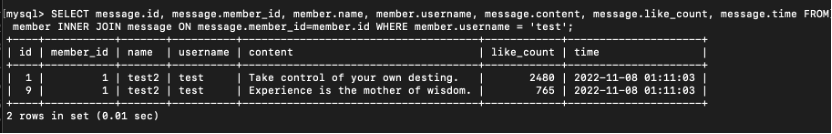

使用SELECT, SQL Aggregate Functions搭配JOIN語法，取得member資料表中欄位username是test的所有留言平均按讚數

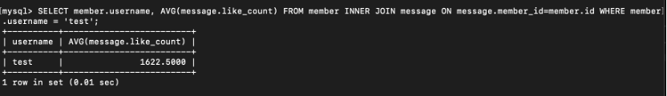
